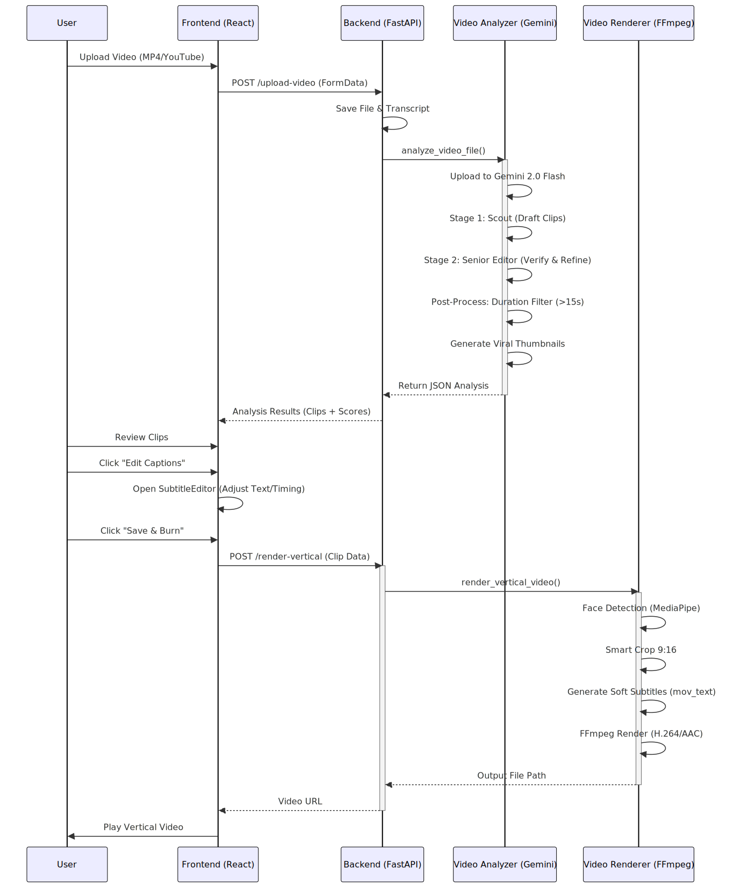

# Podcast Content Analyzer

An AI-powered tool that transforms podcast transcripts into viral short-form video content using **Gemini 2.5 Flash** with deep reasoning capabilities.

## Architecture



## Features

### 6-Stage Analysis Pipeline
1. **Semantic Chunking** - Intelligently segments transcript into 30-90s coherent clips
2. **Viral Potential Analysis** - Scores each segment (0.0-1.0) with editorial reasoning
3. **Clip Refinement** - Optimizes timing and removes filler for maximum impact
4. **Platform Optimization** - Generates hooks, captions, hashtags for social media
5. **Visual Treatment Planning** - Creates shot lists with motion and style specs
6. **Assembly Specification** - Provides technical build instructions for video editors

### Key Capabilities
- **Multimodal Video Analysis**: Direct upload of `.mp4`, `.mov` files. Gemini "watches" the video to find viral moments.
- **High-Speed Analysis**: Powered by Gemini 2.5 Flash for rapid processing.
- **Multi-Format Support**: Handles video files AND .txt, .srt, .vtt transcript files.
- **Deep Editorial Context**: Accepts guest, topic, and tone metadata.
- **Visual Blueprint**: Exports a complete JSON "recipe" for video editors (compatible with automation tools).

## Quick Start

### 1. Backend Setup (Python)
```bash
cd backend
python3 -m venv venv
source venv/bin/activate
pip install -r requirements.txt
```

Create a `.env` file in the `backend/` folder:
```env
GEMINI_API_KEY=your_api_key_here
```

Start the server:
```bash
python3 -m uvicorn main:app --reload --port 8000
```

### 2. Frontend Setup (React)
```bash
# In the root directory
npm install
npm run dev
```

### 3. Usage
1. Open `http://localhost:5173`
2. (Optional) Enter metadata: guest name, topic, tone
3. **Upload Video**: Drag & drop an `.mp4` file to analyze visual & audio cues directly.
4. **OR Upload Transcript**: Upload a .txt, .srt, or .vtt file.
5. Wait for the analysis to complete
6. Review viral clips sorted by viral score
7. Click any clip to view full details and export JSON

## Troubleshooting

### "Analysis failed: RetryError" or 429 Errors
If you assume a `RetryError` or `RESOURCE_EXHAUSTED` error:
1.  **Check API Key**: Ensure your `GEMINI_API_KEY` in `backend/.env` is valid.
2.  **Quota Limits**: The current configuration uses `gemini-2.5-flash` to conform to standard quotas. If you see quota errors, check your usage in [Google AI Studio](https://aistudio.google.com/).
3.  **Restart Server**: Always restart `uvicorn` after changing the `.env` file.

## Transcript Format Examples

### Plain Text (.txt)
```
[00:00:15] Joe Rogan: So you're telling me that AI is going to change everything?
[00:00:22] Elon Musk: Absolutely. I think AI is the most important thing...
```

### SRT (.srt)
```
1
00:00:15,000 --> 00:00:22,000
Joe Rogan: So you're telling me that AI is going to change everything?

2
00:00:22,000 --> 00:00:30,000
Elon Musk: Absolutely. I think AI is the most important thing...
```

### VTT (.vtt)
```
WEBVTT

00:00:15.000 --> 00:00:22.000
Joe Rogan: So you're telling me that AI is going to change everything?

00:00:22.000 --> 00:00:30.000
Elon Musk: Absolutely. I think AI is the most important thing...
```

## API Endpoints

### POST /analyze-podcast
Analyzes podcast transcript through 6-stage pipeline.

### POST /upload-video
**[NEW]** Direct video analysis using Multimodal Gemini 2.5.
- `file` (required): Video file (.mp4, .mov, etc.)

**Response:**
```json
{
  "chunks": [...],
  "analysis": [...],
  "selected_clips": [
    {
      "clip_id": "clip_01",
      "viral_score": 0.87,
      "hook": "AI is more profound than fire",
      "captions": [...],
      "visual_beats": [...],
      "assembly_spec": {...}
    }
  ]
}
```

## Tech Stack
- **Frontend**: React, TypeScript, Vite, TailwindCSS, Lucide Icons
- **Backend**: FastAPI, Python, Google GenAI SDK
- **AI**: Gemini 2.5 Flash (Multimodal Video & Text Analysis)

## Sample Data

## Project Structure

```bash
gemini-video-app/
├── backend/                 # Python FastAPI Backend
│   ├── main.py             # API Entry point & formatting
│   ├── podcast_analyzer.py # Text-based 6-stage pipeline
│   ├── video_analyzer.py   # [NEW] Multimodal Video Analysis pipeline
│   ├── transcript_parser.py # Normalizes .txt/.srt/.vtt files
│   └── requirements.txt    # Python dependencies
├── src/                    # React Frontend
│   ├── ContentFactory.tsx  # Main dashboard component
│   ├── ClipDetailView.tsx  # Detailed view for specific clips
│   └── types.ts            # TypeScript definitions for Analysis result
├── public/                 # Static assets
└── README.md               # Documentation
```

## Roadmap

- [x] **Core Analysis Engine**: 6-stage pipeline using Gemini 2.5 Flash.
- [x] **Smart Parsing**: Support for multiple timestamp formats.
- [x] **Video Upload Support**: Direct video processing using Gemini Multimodal capabilities.
- [ ] **Creative Autopilot**: Image generation for B-roll (Pending Quota/Model Availability).
- [ ] **One-Click Export**: Generate `.mp4` clips using FFmpeg on the backend.
- [ ] **Social Integration**: Direct publishing to TikTok/Instagram APIs.

